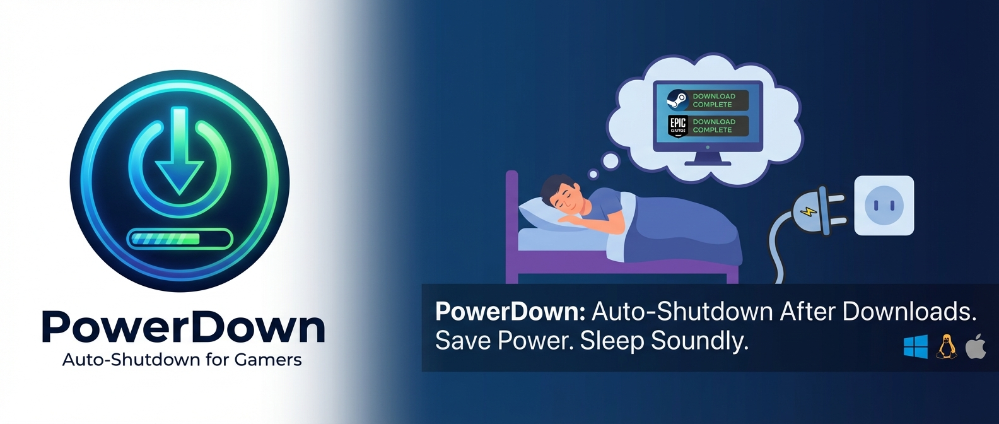

# PowerDown

[](https://github.com/matthew-jones-dev/PowerDown/actions)
[](https://github.com/matthew-jones-dev/PowerDown/releases/latest)
[](LICENSE)
[](https://dotnet.microsoft.com/)
[]()

Automatically shut down your PC when Steam finishes downloading and installing games.

## Features

- **Steam Monitoring** - Track Steam downloads and installs
- **Smart Detection** - Tracks download and installation status without relying on percentages
- **Verification Polling** - Confirms downloads are truly complete before shutting down
- **Cross-Platform Architecture** - Designed for Windows, Linux, and macOS (Windows supported today; Linux/macOS experimental)
- **Configurable Delays** - Adjust verification time, polling interval, and required checks
- **Safe Mode** - Dry-run option to test without actual shutdown
- **Graceful Cancellation** - Stop shutdown from the UI at any time

## Installation

### Download (Recommended)

Grab the latest Windows build from the releases page:

https://github.com/matthew-jones-dev/PowerDown/releases/latest

Download the Windows zip, extract it anywhere, and run `PowerDown.exe`. No repo clone required.

What you get:
- A portable folder with `PowerDown.exe`
- `appsettings.json` in the same folder for configuration

### Build from Source

```bash
git clone https://github.com/matthew-jones-dev/PowerDown.git
cd PowerDown
dotnet build PowerDown.sln
```

### Run (UI)

```bash
dotnet run --project src/PowerDown.UI
```

Convenience scripts:

```bat
scripts\run-ui.cmd
```

```bash
./scripts/run-ui.sh
```

## Usage

### Basic Usage (UI)

Launch the app, click **Start Monitoring**, and leave it running while Steam finishes.

```bash
PowerDown.exe
```

### Settings

Use the in-app **Settings** button, or edit `appsettings.json` next to `PowerDown.exe`:

```json
{
  "PowerDown": {
    "VerificationDelaySeconds": 120,
    "PollingIntervalSeconds": 15,
    "RequiredNoActivityChecks": 5,
    "ShutdownDelaySeconds": 60,
    "MonitorSteam": true,
    "DryRun": false,
    "Verbose": false,
    "CustomSteamPath": ""
  }
}
```

## How It Works

1. **Detection** - Monitors Steam logs and manifests for download activity
2. **Tracking** - Shows active downloads with status updates
3. **Completion** - Detects when all downloads and installations are complete
4. **Verification** - Polls for 120 seconds (configurable) to ensure no new downloads start
5. **Shutdown** - Schedules Windows shutdown after verification passes

## Configuration

### Auto-Detection

PowerDown automatically detects installation paths (Windows shown below; Linux/macOS use standard install locations when available):

**Steam:**
- Reads from: `HKCU\Software\Valve\Steam\SteamPath`
- Falls back to: `%ProgramFiles%\Steam`

### Manual Path Override

If auto-detection fails, provide custom paths:

```bash
PowerDown.exe --steam-path "D:\Steam"
```

## Supported Platforms

### Current

- **Windows** - Full support for Steam
- **Linux** - Experimental support
- **macOS** - Experimental support

## Supported Launchers

### Current

- **Steam** - Full detection and monitoring

## Development

See [docs/DEVELOPMENT.md](docs/DEVELOPMENT.md) for development setup and guidelines.

## Architecture

See [docs/ARCHITECTURE.md](docs/ARCHITECTURE.md) for technical architecture details.

## Design Decisions

See [docs/DESIGN_DECISIONS.md](docs/DESIGN_DECISIONS.md) for architectural decisions and trade-offs.

## Testing

See [docs/TESTING.md](docs/TESTING.md) for testing strategy and guidelines.

## Roadmap

- [ ] Stabilize Linux/macOS support
- [ ] Signed Windows installer
- [ ] System tray integration
- [ ] Additional launchers (GOG, Battle.net, etc.)

## Contributing

Contributions are welcome! Please see [docs/DEVELOPMENT.md](docs/DEVELOPMENT.md) for guidelines.

## License

This project is licensed under the MIT License - see the LICENSE file for details.

## Acknowledgments

- Steam detection inspired by various Steam community tools
- Built with .NET 8 and Avalonia
